# Manukora

Executive briefing system for commercial inventory and demand analysis. Ingests CSV sales data, generates deterministic metrics, and produces narrative briefings using LangGraph-orchestrated Claude agents.

## Quick Start

### Prerequisites
- Node.js 20+
- Supabase project (PostgreSQL + Storage)
- Anthropic API key (optional, required only for Phase 2 agent workflows)

### Setup

```bash
# Install dependencies
npm install

# Configure environment
cp .env.example .env
# Edit .env with your Supabase and Anthropic credentials

# Build backend
npm run -w backend build

# Build frontend
npm run -w web build

# Run tests
npm run -w backend test
```

### Development

```bash
# Start frontend dev server (http://localhost:3000)
npm run -w web dev

# Run backend tests in watch mode
npm run -w backend test

# Type check both packages
npm run -w backend typecheck && npm run -w web typecheck
```

## Architecture

### Phase 1 — Analytics & CSV Processing

**CSV → FactBundle Pipeline**

1. **CSV Parsing** — Validates field mapping, detects duplicates
2. **Deterministic Metrics** — Computes velocity, cover risk, value-at-risk per SKU
3. **Fact Bundle** — Immutable JSON source of truth for all downstream systems
4. **Supabase Storage** — Persists uploads and outputs with versioned paths

**Response Time:** ~20-100ms for typical 1K-row CSV

See [`backend/README.md`](backend/README.md) for detailed architecture and API reference.

### Phase 2 — Briefing Generation (LangGraph Agents)

**FactBundle → Narrative Briefing**

1. **Analyst Agent** (2-min) — Transforms metrics into narrative sections with citations
2. **Auditor Agent** (1-min) — Verifies all claims match FactBundle; detects hallucinations
3. **Orchestration** — Max 2 iterations: generate → audit → (approve|revise|fail)
4. **Storage** — Saves approved briefing markdown to Supabase outputs bucket

**Design:** Fire-and-forget async. Returns FactBundle immediately; agents run in background.



See [`backend/README.md`](backend/README.md#generate-briefing-phase-2--async-langgraph-workflow) for code examples and [`docs/briefing-workflow.svg`](docs/briefing-workflow.svg) for process flow.

## Project Structure

```
manukora/
├── backend/                    # TypeScript analytics library
│   ├── src/
│   │   ├── analytics/         # CSV parsing, metrics, fact bundle
│   │   ├── agents/            # Analyst, Auditor, orchestration (Phase 2)
│   │   ├── services/          # Supabase integration, briefing storage
│   │   ├── db/                # Database types
│   │   ├── env.ts             # Environment validation
│   │   └── index.ts           # Public exports
│   ├── src/*.test.ts          # Unit tests (26 tests, 100% pass)
│   └── README.md              # Backend documentation
│
├── web/                       # Next.js frontend
│   ├── src/
│   │   ├── app/               # Pages (dashboard, inventory, sales, reorders)
│   │   ├── app/api/           # API routes (CSV upload, process, reports)
│   │   ├── components/        # Shadcn/UI-based components
│   │   └── hooks/             # Data fetching hooks (useReportRuns, useUploads)
│   └── README.md              # Frontend documentation
│
├── docs/                      # Project documentation
│   └── briefing-workflow.svg  # Phase 2 process flow diagram
│
├── CLAUDE.md                  # Development standards & Git guidelines
├── .env.example               # Environment template
├── package.json               # Root workspace config
└── README.md                  # This file
```

## Environment Variables

### Required (Phase 1 — CSV Processing)
```
SUPABASE_URL=https://xxxxx.supabase.co
SUPABASE_SERVICE_ROLE_KEY=eyJ...
```

### Required (Phase 2 — Briefing Agents)
```
ANTHROPIC_API_KEY=sk-ant-...
LLM_MODEL=claude-3-5-haiku-20241022
LLM_TEMPERATURE=0.3
```

See `.env.example` for complete template.

## API Routes

### CSV Upload & Processing
- `POST /api/process` — Upload CSV, trigger pipeline, return FactBundle
- `POST /api/uploads` — List uploaded CSVs
- `GET /api/uploads` — Retrieve upload record with signed URLs

### Reports
- `GET /api/reports` — List all report runs
- `GET /api/reports/[id]/outputs` — List outputs for a run (signed URLs to FactBundle, briefing)

See [`web/README.md`](web/README.md) for API response schemas.

## Key Guarantees

### Deterministic Metrics
All numbers in FactBundle are computed from source data with no LLM invention:
- **Velocity** = units sold / 30 (calendar days)
- **Days of Cover** = inventory / velocity
- **Value at Risk** = inventory × retail price
- **Trends** = detected from 3+ consecutive periods

### Auditor Verification
LangGraph Auditor node enforces:
- Every claim cites a FactBundle field
- No hallucinated SKUs or metrics
- Internal logical consistency
- Max 2 iterations (prevents infinite loops)

### Fail-Closed Validation
Invalid rows, missing fields, or duplicates block the pipeline:
```typescript
if (parseResult.errors.length > 0) {
  return { success: false, errors: parseResult.errors };
  // Does NOT invent or skip data
}
```

## Testing

```bash
# Run all tests
npm run -w backend test

# Run tests in watch mode
npm run -w backend test -- --watch

# Type check
npm run -w backend typecheck && npm run -w web typecheck
```

**Coverage:** 26 tests covering CSV parsing, analytics, agent orchestration, timeouts, environment validation.

## Deployment

### Frontend (Vercel)
- Connected to GitHub; deploys on push to main
- Requires environment variables (SUPABASE_URL, SUPABASE_SERVICE_ROLE_KEY, ANTHROPIC_API_KEY)
- Next.js 15.2.4 with React 19

### Backend
- Consumed as npm package (`@manukora/backend`) from monorepo
- Exports types and functions for use in API routes
- Built with `npm run -w backend build`

## Git Workflow

Follow these conventions per `CLAUDE.md`:

```bash
# Commit with clear, descriptive messages (no AI attributions)
git commit -m "feat: add new feature

- What changed and why
- Impact on system
"

# Create feature branches
git checkout -b feature/your-feature

# Push and open PR
git push -u origin feature/your-feature
```

## Future Extensions (Phase 3+)

- PDF generation for briefings
- Human-in-the-Loop (HiTL) gates for risk review
- Scheduled/batch automated briefings
- Supplier lead time & MOQ for order quantity suggestions
- Seasonal decomposition for demand forecasting
- Custom metric plugins

## License

Internal use only.

---

**Documentation:**
- [`backend/README.md`](backend/README.md) — Analytics, FactBundle structure, agent API
- [`web/README.md`](web/README.md) — Frontend components, API routes
- [`CLAUDE.md`](CLAUDE.md) — Development standards, verification checklist
- [`docs/briefing-workflow.svg`](docs/briefing-workflow.svg) — Phase 2 process flow
